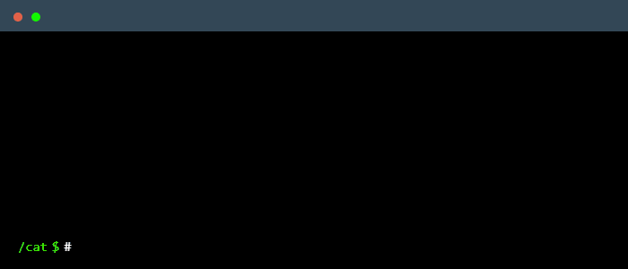

 

    

### ᴀʙᴏᴜᴛ ᴍᴇ
I’m someone who loves exploring every loophole, both technically and physically — always seeking innovative possibilities.  
I have a passion for creating things that are modern, stylish, gorgeous, and clean.  
Most of the time, I choose silence…

### Focused Skills
  

### Currently Learning  

    
    

### Employer?
> [!IMPORTANT]  
> <a href="https://drive.google.com/drive/folders/1hJGhQTtzDUzMqRtoIQUx7QTLtCN726ZK?usp=sharing" download>Download my resume</a>

