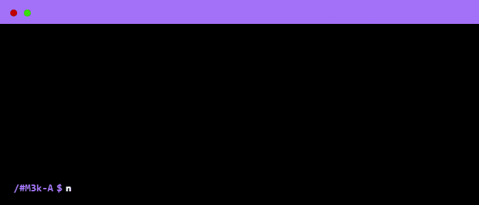

 

    

### ᴀʙᴏᴜᴛ ᴍᴇ
I’m someone who loves exploring every loophole, both technically and physically — always seeking innovative possibilities.  
I have a passion for creating things that are modern, stylish, gorgeous, and clean.  
Most of the time, I choose silence…

### Focused Skills
  

### Currently Learning  
  
Exploring Artificial Intelligence and modern creative technologies.

